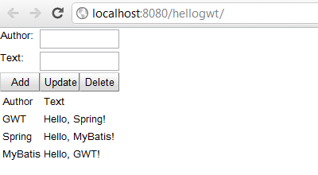

Разрабатываем приложение на Spring и GWT. Часть 5 - UiBinder
------------------------------------------------------------
* `hellogwt-4 - Alex Tretyakov Blog`: [http://alextretyakov.blogspot.com/2012/08/ispolzuem-uibinder.html](http://alextretyakov.blogspot.com/2012/08/ispolzuem-uibinder.html)
* `hellogwt-5 - Revision 17: /trunk`: [http://hellogwt-5.googlecode.com/svn/trunk/](http://hellogwt-5.googlecode.com/svn/trunk/)
> В процессе написания приложения будут использоваться:
>
>- Spring 3.0.5
>- GWT 2.4.0
>- Maven 3.0.3
>- Tomcat 6.0.33 ([http://localhost:8080/hellogwt/](http://localhost:8080/hellogwt/))

>Команда в командной строке - выкачиваем проект на Linux-системе:
>
>[svn checkout --config-option servers:global:http-proxy-host=proxy.pbank.com.ua --config-option servers:global:http-proxy-port=8080 http://hellogwt-5.googlecode.com/svn/trunk/](http://hellogwt-5.googlecode.com/svn/trunk/)
>
>**svn checkout http://hellogwt-5.googlecode.com/svn/trunk/**

>Работа с базой данных с помощью:
>
>- MyBatis 3.0.5
>- MySQL 5.1
>
>По задумке наше приложение позволит пользователю просматривать и редактировать различные приветствия. Каждое приветствие имеет автора и, собственно, текст приветствия.
>
>Создадим с помощью MySQL базу данных и таблицу, в которой будут храниться наши приветствия. Выполним следующие SQL-команды:

>**CREATE DATABASE hellogwt;**
>
>**USE hellogwt;**
>
>**CREATE TABLE greetings (**
>**id INT NOT NULL AUTO_INCREMENT,**
>**author VARCHAR(30),**
>**text VARCHAR(50),**
>**PRIMARY KEY (id)**
>**);**

>В результате изменений содержимое класса HelloGWT сильно сократилось и теперь в его обязанности не входит создание UI и логики работы приложения - за это отвечает объект helloGWTWidget

